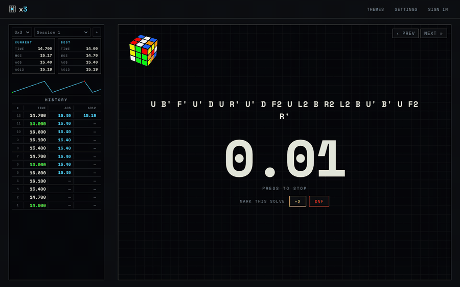

# x3

**A speedcubing timer for the browser.**

Inspired by csTimer. Hold to start, WCA random-state scrambles, a few fun themes, and optional Google sign-in to sync your solves across devices.

## Features

- **Timer**: hold-to-start (keyboard or touch) with a stackmat-style arm and `+2` / `DNF` penalties
- **Scrambles**: WCA random-state scrambles via [cubing.js](https://js.cubing.net/cubing/), with an offline fallback
- **Sync**: fully local by default (your solves stay in the browser); sign in with Google to sync across devices
- **Themes**: a handful of fun ones, searchable

## Tech stack

vanilla HTML/CSS/JS (ES modules) · [cubing.js](https://js.cubing.net/cubing/) · [FastAPI](https://fastapi.tiangolo.com/) · SQLite via [SQLAlchemy 2.0](https://www.sqlalchemy.org/) + [Alembic](https://alembic.sqlalchemy.org/) · Docker

## Getting started

Run it locally, test, or set up Google sign-in for local dev: see [docs/README.md](docs/README.md).

## Credits

Scrambles and the 3D cube viewer are powered by [cubing.js](https://github.com/cubing/cubing.js/).

## License

[MIT](LICENSE) · Copyright (c) 2026 vinayakj02
